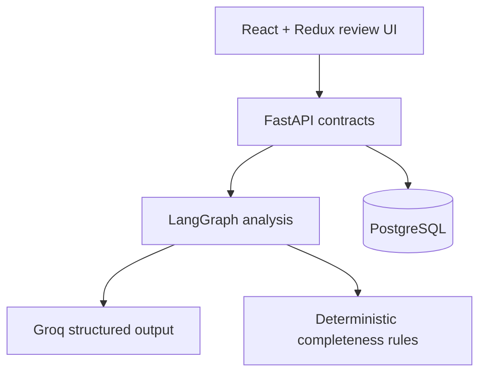

# Pharma Complaint Copilot

An AI-assisted customer complaint intake prototype for pharmaceutical quality teams. It turns pasted narratives or text-based PDFs into a structured, reviewable draft, highlights missing fields, suggests risk triage, accepts controlled corrections, and commits only after an explicit human action.

This project was built for the AIVOA AI Product Engineer internship assignment. All included complaint examples are synthetic.

This is an independently developed assignment prototype, not an official AIVOA product or endorsement.

## Deployment status

- [Public source repository](https://github.com/sauravoole-ai/pharma-complaint-copilot)
- [Backend health endpoint](https://pharma-complaint-copilot-api.onrender.com/api/v1/health)
- No verified public frontend yet. The prior live analysis returned HTTP 502;
  live AI and the complete production workflow have not passed verification.
- Dated evidence and remaining gates are recorded in `docs/verification/live-integration.md`.

## What the product demonstrates

- React + Redux Toolkit workflow with a responsive two-panel review experience.
- Python + FastAPI API with strict Pydantic request and response contracts.
- LangGraph orchestration for extraction, deterministic completeness checks, risk suggestion, and summary.
- Groq structured JSON output using a configurable model (`openai/gpt-oss-20b` by default).
- PostgreSQL JSONB drafts and normalized committed ledger records through SQLAlchemy and Alembic.
- Text and bounded PDF intake, controlled conversational patches, direct form-edit persistence, and idempotent human commit.
- Explicit AI labels, missing-field states, safe errors, and no fabricated fallback data.

It is a decision-support prototype—not a validated QMS, medical device, electronic-signature system, or regulatory determination engine.

## Architecture



The model proposes facts and risk guidance. Pydantic rejects malformed output, deterministic rules decide completeness, an allow-list constrains corrections, and the reviewer controls the final ledger commit.

## Local setup

Prerequisites: Python 3.11+, [uv](https://docs.astral.sh/uv/), Node.js 20+, npm, and Docker Compose.

1. Copy `.env.example` to `.env` and add a Groq API key.
2. Start PostgreSQL and apply the migration:

   ```bash
   docker compose up -d db
   cd backend
   uv sync --extra dev
   uv run alembic upgrade head
   ```

3. Run the API from `backend/`:

   ```bash
   uv run uvicorn app.main:app --reload --port 8000
   ```

4. In another terminal, run the client from `frontend/`:

   ```bash
   npm install
   VITE_API_BASE_URL=http://localhost:8000 npm run dev
   ```

Open `http://localhost:5173`.

## Environment variables

| Variable | Purpose | Default |
|---|---|---|
| `DATABASE_URL` | SQLAlchemy PostgreSQL connection | local `complaints` database |
| `GROQ_API_KEY` | Groq API credential | required for analysis |
| `GROQ_MODEL` | Groq model ID | `openai/gpt-oss-20b` |
| `FRONTEND_ORIGIN` | Exact CORS origin | `http://localhost:5173` |
| `MAX_UPLOAD_BYTES` | PDF byte limit | 5 MiB |
| `VITE_API_BASE_URL` | Browser API origin | same origin |

Never commit `.env` or real complaint data.

## Verification

```bash
cd backend
uv run --extra dev pytest -q
uv run --extra dev ruff check .
uv run --extra dev ruff format --check .

cd ../frontend
npm test -- --run
npm run typecheck
npm run build

cd ..
npm install
npx playwright install chromium
npm run test:e2e
```

The end-to-end test uses an in-memory SQLite database and deterministic fake model only as a test harness. Production configuration remains PostgreSQL + Groq.

For the complete offline suite, run `npm run verify` from the repository root. The live Groq smoke test is intentionally opt-in:

```bash
cd backend
RUN_LIVE_AI=1 GROQ_API_KEY=your_key uv run pytest tests/live/test_groq_smoke.py -q
```

Deployment manifests are included for a Render API (`render.yaml`) and Vercel Vite client (`frontend/vercel.json`). They contain no credentials; configure the unsupplied values in the chosen platform only when deploying.

## Engineering and verification material

- [`docs/submission/code-walkthrough.md`](docs/submission/code-walkthrough.md): an end-to-end engineering walkthrough.
- [`docs/verification/production.md`](docs/verification/production.md): the production verification record to complete only after deployment.
- [`docs/verification/live-integration.md`](docs/verification/live-integration.md): current local evidence and explicitly unverified live integrations.

Frontend URLs must be added only after the deployment succeeds and is independently verified. A deployed backend alone is not a working-product claim.

## Synthetic test inputs

- `samples/discoloration-complaint.txt`: paste-flow example.
- `samples/foreign-matter-complaint.pdf`: selectable-text PDF-flow example.
- Regenerate the PDF with `python scripts/generate_sample_pdf.py` from the repository root.

No customer, patient, batch, or company data in these samples is real.

## API summary

| Method | Path | Purpose |
|---|---|---|
| `POST` | `/api/v1/complaint-drafts/analyze-text` | Analyze pasted narrative |
| `POST` | `/api/v1/complaint-drafts/analyze-file` | Analyze one text-based PDF |
| `PATCH` | `/api/v1/complaint-drafts/{id}/conversation` | Apply a constrained natural-language correction |
| `PATCH` | `/api/v1/complaint-drafts/{id}/fields` | Persist reviewer form edits |
| `POST` | `/api/v1/complaints` | Commit a ready draft with an idempotency token |
| `GET` | `/api/v1/complaints` | List committed records |
| `GET` | `/api/v1/health` | Safe application/database health |

## Deliberate trade-offs

- Scanned PDFs are rejected with a clear insufficient-text response; OCR is outside this prototype.
- Authentication, audit signatures, role-based approval, attachments, and regulatory retention are not claimed.
- AI risk is visibly advisory and is recalculated after accepted edits, but a qualified reviewer remains accountable.
- Draft source text is represented by a SHA-256 hash rather than stored verbatim, reducing unnecessary sensitive-data retention.

## AI-assistance disclosure

AI tools supported implementation and review. The workflow, constraints, code paths, tests, and product decisions were inspected and adapted for this assignment rather than copied as an opaque generated solution.
